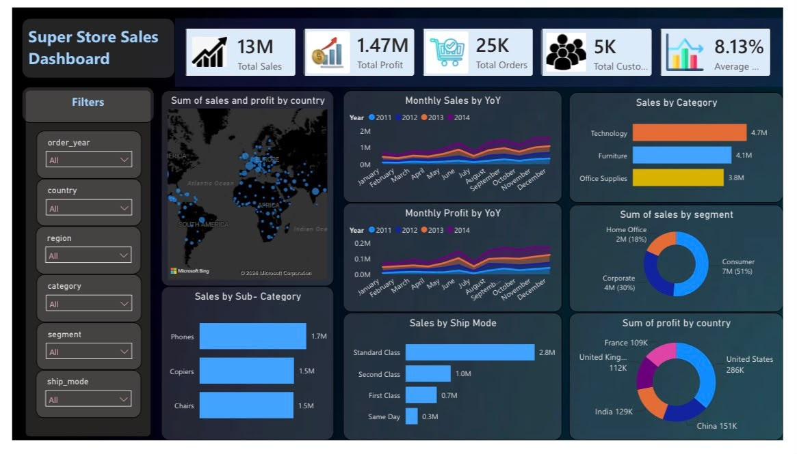

# Superstore Sales Analysis

# Project Overview
This project analyzes Superstore sales data using SQL, Python, and Power BI to uncover business insights related to sales performance, profitability, customer segments, and regional trends.

# Tools Used
- SQL (PostgreSQL)
- Python (Pandas, Matplotlib)
- Power BI

# Repository Contents
- `Superstore_Project.sql` – SQL queries for data analysis
- `Superstore_Analysis.ipynb` – Python data analysis
- `Superstore_Dashboard.pbix` – Interactive Power BI dashboard
- `Superstore_Dataset.csv` – Dataset
- `Dashboard.png` – Dashboard preview

# Key Insights
- Identified top-performing product categories.
- Compared sales and profit across regions.
- Analyzed customer segments and purchasing behavior.
- Built an interactive Power BI dashboard for business insights.

# Dashboard Preview

# Author
Rohan
